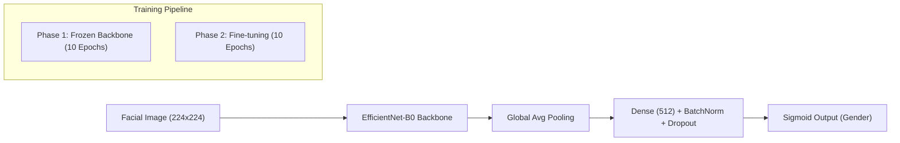

# 🚻 Gender Classification with EfficientNet-B0

[](https://www.python.org/downloads/)
[](https://opensource.org/licenses/MIT)
[](#)

A state-of-the-art gender classification system built using **EfficientNet-B0**, optimized for both high-accuracy GPU training and high-speed CPU deployment via **INT8 Dynamic Quantization**.

---

## 🚀 Key Highlights

- **99.59% Test Accuracy**: Near-perfect performance on held-out datasets.
- **4x Inference Speedup**: Optimized with INT8 CPU quantization for real-time applications.
- **Robust Inference**: Includes **Test Time Augmentation (TTA)** for increased reliability.
- **Efficient Architecture**: Leverages transfer learning from ImageNet-weighted EfficientNet-B0.

---

## 📊 Performance Metrics

| Split | Accuracy | F1-Score | ROC-AUC |
| :--- | :--- | :--- | :--- |
| **Validation** | 98.34% | 0.9787 | 0.9989 |
| **Test** | **99.59%** | **0.9958** | **0.9999** |

### CPU Optimization (INT8)
| Version | Latency (CPU) | Throughput | Model Size |
| :--- | :--- | :--- | :--- |
| **Standard (FP32)** | 118 ms/img | 8.4 fps | 18.09 MB |
| **Quantized (INT8)** | **28.5 ms/img** | **35.0 fps** | **17.58 MB** |

---

## 🏗️ Architecture & Methodology

The model employs a two-phase training strategy to ensure stable convergence and fine-grained feature extraction.



### Technical Design Specs:
- **Optimizer**: Adam with `ReduceLROnPlateau` scheduling.
- **Loss Function**: Weighted Binary Cross-Entropy to handle class imbalance.
- **Augmentation**: Random resizing, cropping, horizontal flips, and color jittering.

---

## 📁 Project Structure

```text
Team2_Equalis/
├── model/
│   ├── train.py            # Phase 1 & 2 training logic
│   ├── model.py            # Architecture definitions
│   ├── data_loader.py      # Optimized data pipelines
│   ├── inference.py        # CPU/GPU inference API
│   ├── quantize.py         # INT8 quantization script
│   ├── utils.py            # TTA, Grad-CAM, & metrics
│   └── outputs/            # Checkpoints & visualizations
├── README.md               # Main project documentation
└── requirements.txt        # Dependency list
```

---

## 🛠️ Getting Started

### 1. Installation
```bash
git clone https://github.com/YatindraRai002/Gender-Classification-Model.git
cd Gender-Classification-Model
pip install -r requirements.txt
```

### 2. Inference
Run a prediction on a single image:
```bash
# Standard Inference
python model/inference.py --image path/to/image.jpg --checkpoint model/outputs/best_efficientnet_b0.pth

# High-Speed Optimized Inference (CPU)
python model/inference.py --image path/to/image.jpg --checkpoint model/outputs/quantized_efficientnet_b0.pth
```

### 3. Training
To reproduce training:
```bash
cd model
python train.py --model efficientnet_b0 --data-dir "../Dataset"
```

---

## ⚖️ Ethical Considerations

- **Binary Representation**: This model treats gender as binary, which does not represent the full spectrum of gender identity.
- **Bias**: Facial recognition models can inherit biases from training data. Users should audit performance across diverse demographic groups.
- **Privacy**: Ensure compliance with local privacy laws and obtain necessary consent before processing personal imagery.

---


